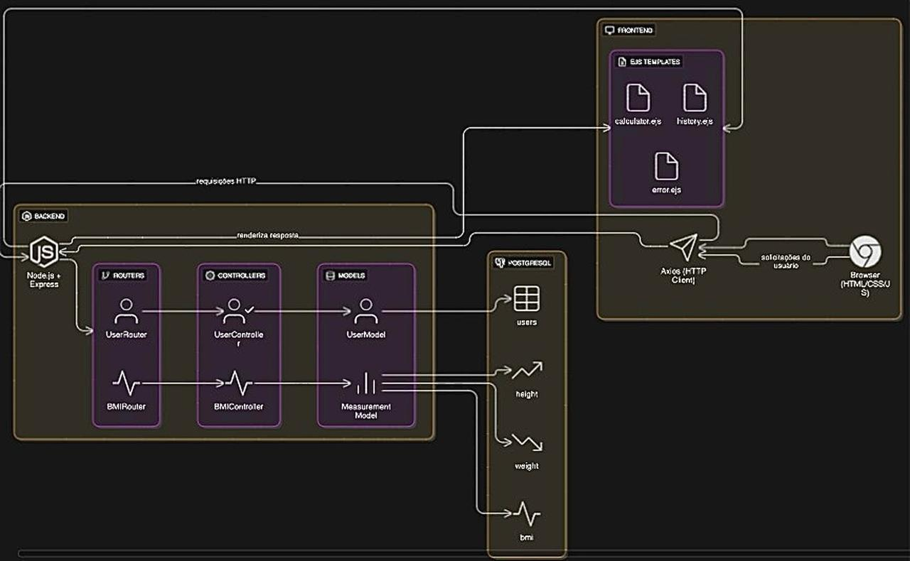
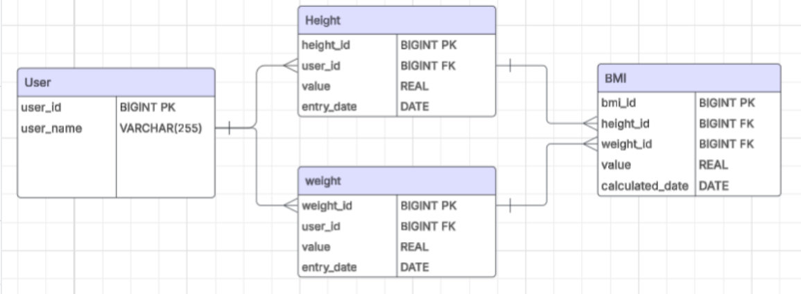

# Calculadora de IMC - Documento de Aplicação Web (WAD)

## Autor
Gabriel Andrei dos Reis

## 1. Introdução e Visão Geral do Projeto

A aplicação web Calculadora de IMC foi desenvolvida como projeto individual para estudos em desenvolvimento web utilizando tecnologias comumente usadas. O sistema permite calcular o Índice de Massa Corporal (IMC) de usuários, mantendo um histórico personalizado de medições e oferecendo uma interface intuitiva e responsiva.

### 1.1 Objetivos do Projeto
- Implementar uma aplicação web completa seguindo o padrão MVC
- Demonstrar integração entre frontend e backend com banco de dados
- Aplicar boas práticas de desenvolvimento e organização de código
- Criar uma interface de usuário funcional e esteticamente agradável

## 2. Decisões Técnicas e Arquitetura

### 2.1 Escolha das Tecnologias

#### Backend
- **Node.js**: Escolhido pela facilidade de desenvolvimento JavaScript
- **Express.js**: Framework web ideal para APIs RESTful e aplicações web
- **PostgreSQL**: uso para o Banco de dados open-source

#### Frontend
- **EJS**: Template engine que permite renderização server-side com sintaxe simples e integração natural com Express
- **CSS**: Escolha por controle total sobre estilos
- **Fetch API**: Para comunicação assíncrona entre frontend e backend

### 2.2 Padrão Arquitetural MVC

A implementação segue rigorosamente o padrão MVC:



- **Models**: Encapsulam a lógica de acesso a dados e regras de negócio
- **Views**: Responsáveis pela apresentação e interface do usuário
- **Controllers**: Gerenciam o fluxo de dados entre Models e Views

### 2.3 Estrutura de Banco de Dados


#### Tabela: users
| Campo | Tipo | Descrição |
|-------|------|-----------|
| user_id | SERIAL | Identificador único do usuário (PK) |
| name | VARCHAR(100) | Nome do usuário |
| email | VARCHAR(100) | Email do usuário (UNIQUE) |
| created_at | TIMESTAMP | Data e hora de criação do registro |

#### Tabela: height
| Campo | Tipo | Descrição |
|-------|------|-----------|
| height_id | SERIAL | Identificador único da altura (PK) |
| user_id | INTEGER | Referência ao usuário (FK) |
| value | FLOAT | Valor da altura em metros |
| entry_date | DATE | Data de registro da altura |

#### Tabela: weight
| Campo | Tipo | Descrição |
|-------|------|-----------|
| weight_id | SERIAL | Identificador único do peso (PK) |
| user_id | INTEGER | Referência ao usuário (FK) |
| value | FLOAT | Valor do peso em kg |
| entry_date | DATE | Data de registro do peso |

#### Tabela: bmi
| Campo | Tipo | Descrição |
|-------|------|-----------|
| bmi_id | SERIAL | Identificador único do IMC (PK) |
| height_id | INTEGER | Referência à altura (FK) |
| weight_id | INTEGER | Referência ao peso (FK) |
| value | FLOAT | Valor calculado do IMC |
| measure_date | DATE | Data de cálculo do IMC |

### 2.4 Relacionamentos do Banco
- Um usuário pode ter múltiplos registros de altura (1:N)
- Um usuário pode ter múltiplos registros de peso (1:N)
- Cada registro de IMC está associado a um registro de altura e um de peso (N:1)

## 3. Principais Desafios Enfrentados e Soluções

### 3.1 Configuração do Ambiente de Desenvolvimento
**Desafio**: Configuração inicial do ambiente Node.js com PostgreSQL e gerenciamento de dependências.

**Solução**: 
- Utilização do `package.json` para gerenciamento automatizado de dependências
- Configuração de variáveis de ambiente com `dotenv` para maior segurança
- Criação de scripts automatizados para inicialização do banco de dados

### 3.2 Implementação do Padrão MVC
**Desafio**: Manter a separação clara de responsabilidades entre as camadas da aplicação.

**Solução**:
- Criação de uma estrutura de pastas bem definida
- Implementação de classes específicas para cada Model
- Controllers focados apenas na lógica de controle de fluxo
- Views dedicadas exclusivamente à apresentação

### 3.3 Integração Frontend-Backend
**Desafio**: Implementar comunicação assíncrona eficiente entre as interfaces e a API.

**Solução**:
- Utilização da Fetch API para requisições AJAX
- Implementação de tratamento de erros robusto
- Feedback visual adequado para o usuário durante operações

### 3.4 Modelagem de Dados Relacional
**Desafio**: Criar um modelo de dados que permita rastreamento histórico eficiente.

**Solução**:
- Normalização adequada das tabelas
- Uso de chaves estrangeiras para manter integridade referencial
- Indexação implícita para otimizar consultas de histórico

### 3.5 Gerenciamento de Estados e Erros
**Desafio**: Manter consistência de dados e tratar adequadamente situações de erro.

**Solução**:
- Implementação de validações tanto no frontend quanto no backend
- Sistema de tratamento de exceções em todas as camadas
- Mensagens de erro claras e informativas para o usuário

## 4. Aprendizados e Reflexões

### 4.1 Principais Aprendizados

#### Técnicos
- **Arquitetura MVC**: Compreensão profunda da importância da separação de responsabilidades
- **Desenvolvimento Full-Stack**: Integração eficiente entre todas as camadas da aplicação
- **Banco de Dados Relacional**: Modelagem de dados e otimização de consultas
- **APIs RESTful**: Implementação de endpoints seguindo padrões REST
- **Frontend Moderno**: Uso de JavaScript assíncrono e manipulação dinâmica do DOM

#### Soft Skills
- **Resolução de Problemas**: Capacidade de identificar e solucionar problemas complexos
- **Planejamento**: Importância do planejamento adequado antes da implementação
- **Documentação**: Valor da documentação clara para manutenção futura

### 4.2 Pontos que Funcionaram Bem

#### Arquitetura e Organização
- **Estrutura MVC**: Facilitou desenvolvimento e manutenção
- **Modularização**: Código bem organizado e reutilizável
- **Separação de Responsabilidades**: Cada componente com função bem definida

#### Performance e Usabilidade
- **Interface de Usuário**: Design simples mas funcional, com boa usabilidade
- **Responsividade**: Aplicação funciona adequadamente em diferentes contextos
- **Performance**: Consultas otimizadas e carregamento eficiente

#### Segurança e Confiabilidade
- **Validação de Dados**: Implementação robusta de validações
- **Proteção contra Ataques**: Prevenção de injeção SQL e outras vulnerabilidades
- **Tratamento de Erros**: Sistema robusto de captura e tratamento de exceções

### 4.3 Pontos de Melhoria Identificados

#### Funcionalidades
- **Autenticação**: Implementação de sistema de login e sessões de usuário
- **Autorização**: Controle de acesso baseado em papéis
- **Notificações**: Sistema de alertas e notificações para usuários

#### Técnicas
- **Testes**: Implementação de testes unitários e de integração
- **Logging**: Sistema de logs mais abrangente para monitoramento
- **Cache**: Implementação de cache para melhoria de performance

#### Interface
- **Responsividade**: Melhoria do design para dispositivos móveis
- **Acessibilidade**: Implementação de recursos para usuários com deficiências
- **Experiência do Usuário**: Feedback mais rico e interativo

## 5. Estrutura Técnica e Funcionalidades

### 5.1 Organização do Projeto
```
ProjetoINDIVIDUAL/
├── config/
│   └── db.js              # Configuração do banco de dados
├── controllers/
│   ├── bmiController.js   # Lógica de controle para IMC
│   └── userController.js  # Lógica de controle para usuários
├── models/
│   ├── userModel.js       # Modelo de dados para usuários
│   └── measurementModel.js# Modelo de dados para medições
├── views/
│   ├── calculator.ejs     # Interface da calculadora
│   ├── history.ejs        # Interface do histórico
│   └── error.ejs          # Interface de erro
├── routes/
│   ├── index.js           # Roteamento principal
│   ├── userRoutes.js      # Rotas de usuários
│   ├── bmiRoutes.js       # Rotas de IMC
│   └── frontRoutes.js     # Rotas do frontend
├── public/css/
│   └── style.css          # Estilos da aplicação
├── scripts/
│   ├── init.sql           # Script de inicialização do banco
│   └── runSQLScript.js    # Executor de scripts SQL
├── services/
│   └── userService.js     # Serviços de usuário
└── server.js              # Servidor principal
```

### 5.2 Funcionalidades Implementadas

#### Calculadora de IMC
- Formulário intuitivo para entrada de dados
- Validação de dados em tempo real
- Cálculo automático com classificação de resultado
- Feedback visual imediato

#### Gerenciamento de Usuários
- Identificação por email (criação automática se não existir)
- Associação de medições ao usuário correto
- Histórico personalizado por usuário

#### Histórico de Medições
- Visualização cronológica das medições
- Tabela organizada com todos os dados relevantes
- Classificação automática de cada registro de IMC

### 5.3 Fluxo de Dados
1. **Entrada**: Usuário preenche formulário na interface
2. **Validação**: Sistema valida dados no frontend e backend
3. **Processamento**: Controller processa dados através dos Models
4. **Armazenamento**: Dados são persistidos no PostgreSQL
5. **Cálculo**: Sistema calcula IMC automaticamente
6. **Resposta**: View apresenta resultado formatado ao usuário

## 6. API e Endpoints

### 6.1 Endpoints da API REST

#### Usuários
| Método | Endpoint | Descrição |
|--------|----------|-----------|
| GET | /api/users | Lista todos os usuários |
| GET | /api/users/:id | Obtém detalhes de um usuário específico |
| POST | /api/users | Cria um novo usuário |
| PUT | /api/users/:id | Atualiza dados de um usuário existente |
| DELETE | /api/users/:id | Remove um usuário |

#### IMC
| Método | Endpoint | Descrição |
|--------|----------|-----------|
| POST | /api/bmi/calculate | Calcula e armazena o IMC |
| GET | /api/bmi/history/:userId | Obtém histórico de IMC de um usuário |

### 6.2 Rotas do Frontend
| Método | Endpoint | View | Descrição |
|--------|----------|------|-----------|
| GET | / | calculator.ejs | Página principal com calculadora |
| GET | /history | history.ejs | Histórico de medições |

## 7. Considerações de Segurança e Performance

### 7.1 Segurança
- Validação de dados de entrada em múltiplas camadas
- Proteção contra injeção SQL usando consultas parametrizadas
- Variáveis de ambiente para credenciais sensíveis
- Tratamento seguro de erros sem exposição de informações internas

### 7.2 Performance
- Pool de conexões para otimização de acesso ao banco
- Consultas SQL otimizadas para minimizar tempo de resposta
- Carregamento assíncrono de recursos no frontend
- Estrutura modular para facilitar manutenção e escalabilidade

## 8. Conclusão e Perspectivas Futuras

### 8.1 Avaliação Geral
A Calculadora de IMC representa uma implementação completa e funcional de uma aplicação web moderna, demonstrando competências técnicas em desenvolvimento full-stack. O projeto conseguiu atingir todos os objetivos propostos, oferecendo uma solução robusta e escalável para cálculo e acompanhamento de IMC.

### 8.2 Impacto do Desenvolvimento
A experiência de desenvolvimento proporcionou aprendizado significativo em:
- Tecnologias web modernas e suas integrações
- Padrões arquiteturais e sua aplicação prática
- Boas práticas de programação e organização de código
- Desenvolvimento orientado a problemas reais

### 8.3 Próximos Passos
O projeto serve como base sólida para futuras expansões:
- Implementação de autenticação e autorização
- Desenvolvimento de funcionalidades de relatórios
- Integração com APIs externas de saúde
- Migração para arquiteturas mais modernas (microserviços)

### 8.4 Reflexão Final
O padrão MVC se mostrou eficaz para organização do código, facilitando tanto o desenvolvimento inicial quanto a manutenção futura. A escolha das tecnologias (Node.js, Express, PostgreSQL, EJS) se mostrou acertada, proporcionando desenvolvimento eficiente e resultado final satisfatório.

Este projeto demonstra não apenas competência técnica, mas também capacidade de planejamento, execução e reflexão crítica sobre o processo de desenvolvimento, elementos essenciais para um desenvolvedor full-stack moderno.